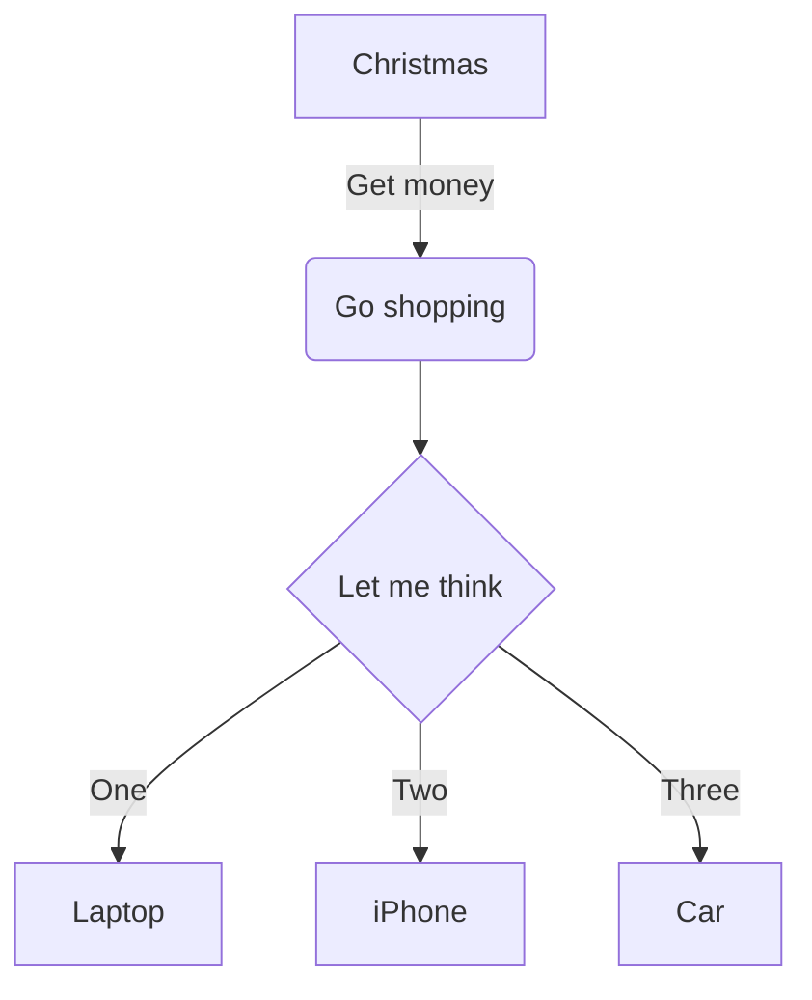
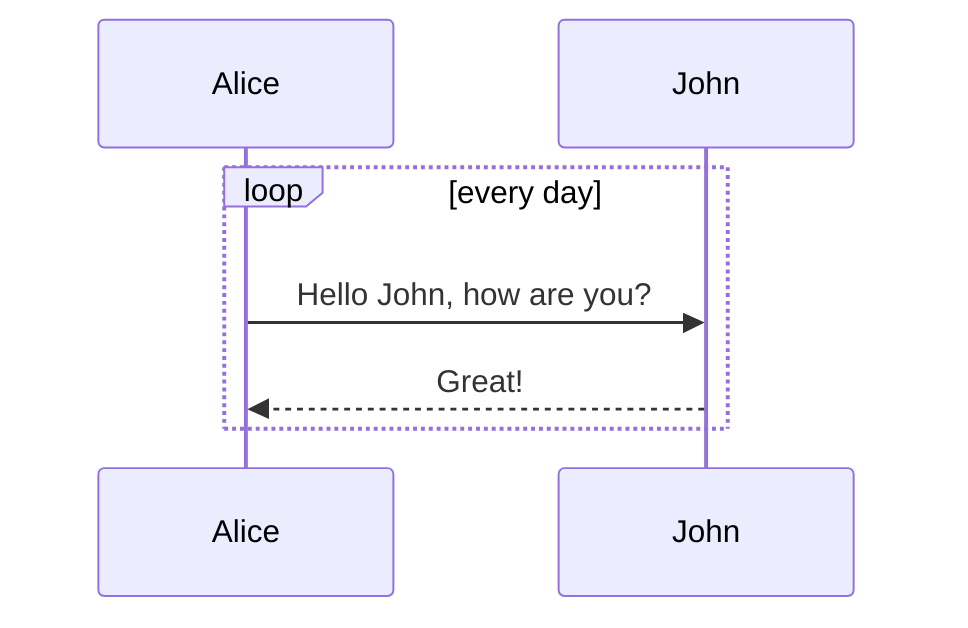
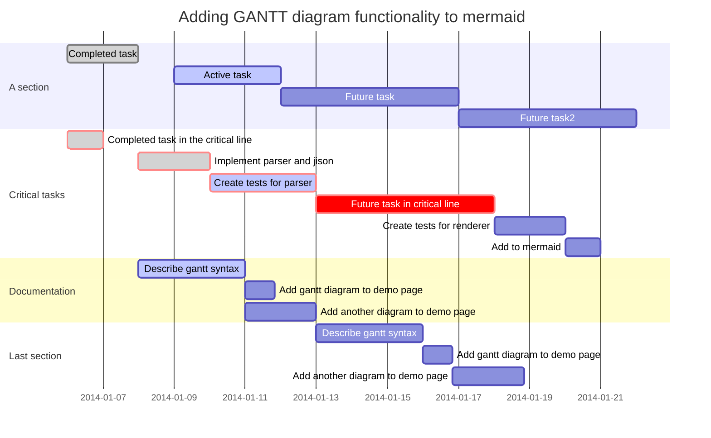

Markdown 流程图，干特图。
<!--more-->
# 流程图 (Flowchart)

```mermaid
graph TD
    A[Christmas] -->|Get money| B(Go shopping)
    B --> C{Let me think}
    C -->|One| D[Laptop]
    C -->|Two| E[iPhone]
    C -->|Three| F[Car]
```

# 序列图  (Sequence diagram)

```mermaid
sequenceDiagram
    loop every day
        Alice->>John: Hello John, how are you?
        John-->>Alice: Great!
    end
```

# 甘特图 (Gantt diagram)

```mermaid
gantt
    dateFormat  YYYY-MM-DD
    title Adding GANTT diagram functionality to mermaid

    section A section
    Completed task            :done,    des1, 2014-01-06,2014-01-08
    Active task               :active,  des2, 2014-01-09, 3d
    Future task               :         des3, after des2, 5d
    Future task2               :         des4, after des3, 5d

    section Critical tasks
    Completed task in the critical line :crit, done, 2014-01-06,24h
    Implement parser and jison          :crit, done, after des1, 2d
    Create tests for parser             :crit, active, 3d
    Future task in critical line        :crit, 5d
    Create tests for renderer           :2d
    Add to mermaid                      :1d

    section Documentation
    Describe gantt syntax               :active, a1, after des1, 3d
    Add gantt diagram to demo page      :after a1  , 20h
    Add another diagram to demo page    :doc1, after a1  , 48h

    section Last section
    Describe gantt syntax               :after doc1, 3d
    Add gantt diagram to demo page      : 20h
    Add another diagram to demo page    : 48h
```
---
**参考**
- [Mermaidjs](https://mermaidjs.github.io/)
